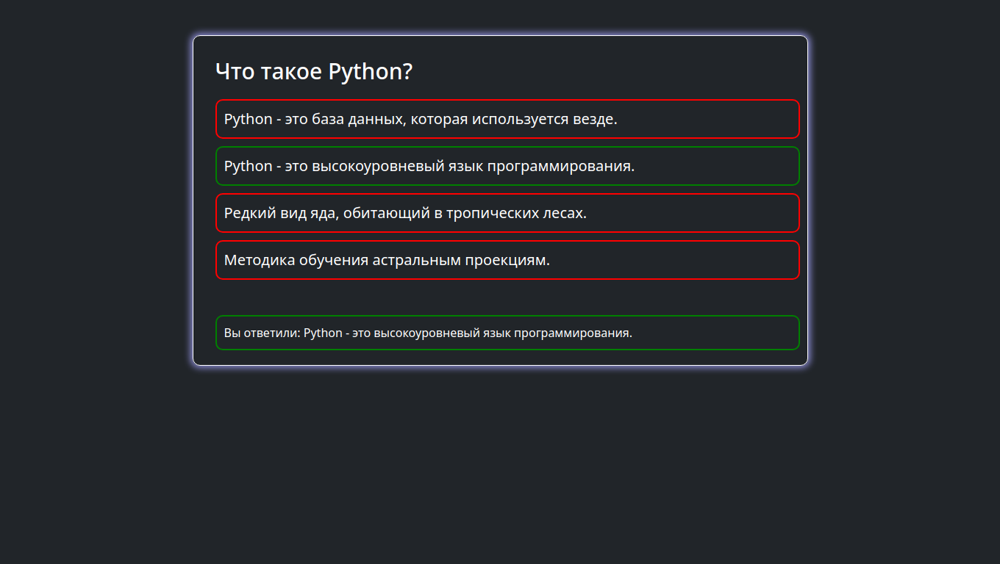

# Приложение опросник на Django
## Демо фотографий:




## Запуск
### Создание базы данных:
```
python3 manage.py migrate
```
### Создание суперпользователя:
```
python3 manage.py createsuperuser
```
### Запуск отладочного сервера:
```
python3 manage.py runserver
```
Вопросы создаются через админу, ответы тоже.
### Развлекайтесь! ⚡️